# Domenica's Portfolio 1 website

## User-Centric Frontend Development Milestone Project.

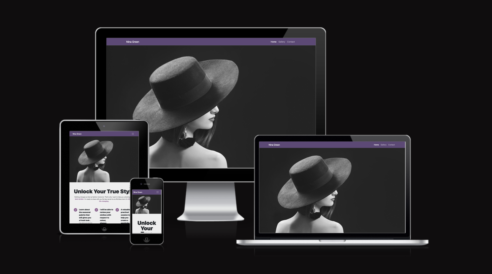

Website presents Domenica's portfolio-1 project for a Fashion Personal Stylist.
Users will be able to find interesting content in easy and simple way.

This project is for educational purposes and can not be used as a template for a business use.
Main aim is to build responsive website with HTML and CSS only. I will use Bootstrap framework to keep website consent and clear.

## [View life website in github pages](https://domenicasantana.github.io/fashion-stylist/index.html)
---

# Table of contents

- [UX](#ux)
    - [Website owner business goals](#website-owner-business-goals)
    - [User goals](#user-goals)
        - [New user goals](#new-user-goals)
        - [Returning user goals](#returning-user-goals)
        - [Website owner business goals](#website-owner-business-goals)
    - [User stories](#user-stories)
    - [Structure of the website](#structure-of-the-website)
    - [Wireframes](#wireframes)
    - [Surface](#surface)
- [Features](#features)
- [Technology](#technology)
- [Testing](#testing)
    - [Functionality testing](#functionality-testing)
    - [Compatibility testing](#compatibility-testing)
    - [Code Validation](#code-validation)
    - [User stories testing](#user-stories-testing)
    - [Issues found during site development](#issues-found-during-site-development)
    - [Performance testing](#performance-testing)
- [Deployment](#deployment)
- [Credits](#credits)
- [Screenshots](#screenshots)

# UX

## Website owner business goals

The main purpose of this website is to help present a Personal Stylist to the public.
Page owner can present herself, her professional development path, and proven achievements.
Also this website is the best place to show the different types of personal services that she can offer to all customers, assuring new ones , using pictures and  testimony from previous customers.

## User goals

### New user goals:
- user is able to find information about the Personal Stylist.
- user can easily locate  current client testimony.

### Returning user goals:
- user can learn more about the Personal Stylist new services.
- user is able to find gallery with pictures of updated results of new customers .
- user can send a message to the Stylist using a contact form.

## User stories

### As a business owner:
* I would like to present myself and my offer on the website clearly to potential customers.
* I need to make sure that my current and new customers will find a professional help and motivation in the website .
* I want my customers to be able to learn how to use my website intuitively and easily.
* I would like to build and maintain relationship with potential and current customers.

### As a new customer:
* I wish to find information about the personal the services that the stylist offers .
* I would like to be able to contact the personal stylist with any questions I may have about her services. 
* I want to hire her as my personal stylist , to understand how to dress myself , feel confident  and find a way to use everything I have in my closet without spending more money ans reusing what I already have.

### As a returning customer:

* I need to keep contacting my personal stylist through the website to buy new sessions, products or serivices that she offers.
* I want to refer this personal stylist to my friends or family and show them the gallery of pictures with all the results of previous customers in that way they will feel reasured of buying her services that she offers. 

## Structure of the website

The website is designed to be easy and user-friendy on all type of devices. On desktop, tablet or mobile device there should be no difference for a user to have a fantastic experience. All parts are designed to achieve maximum user satisfaction including the color palette that has been used. User will get some interaction from the interface as there are some effects in bottons of  the navbar.

## Wireframes

I used website balsamiq.cloud to create the wireframes for desktop, tablet and mobile view.

## Desktop View Home

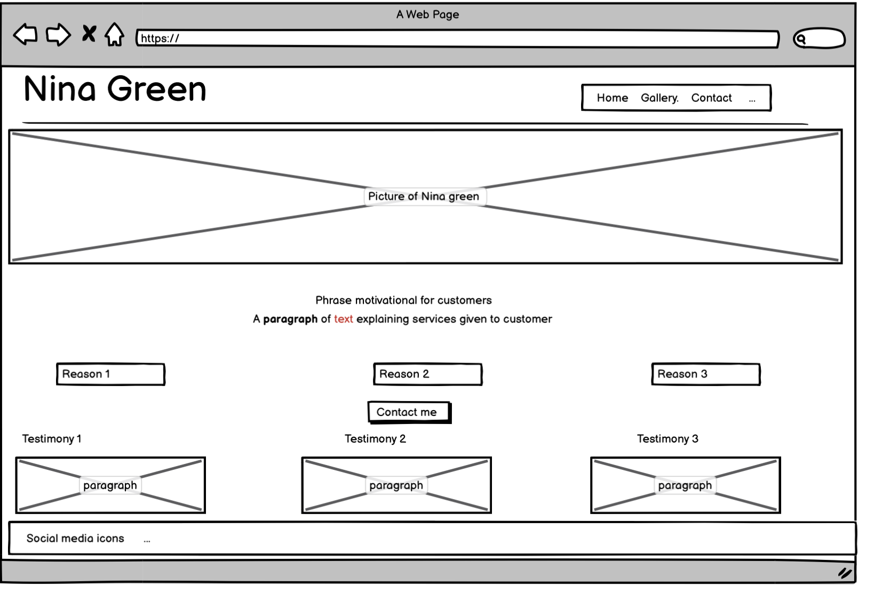

## Desktop View Gallery
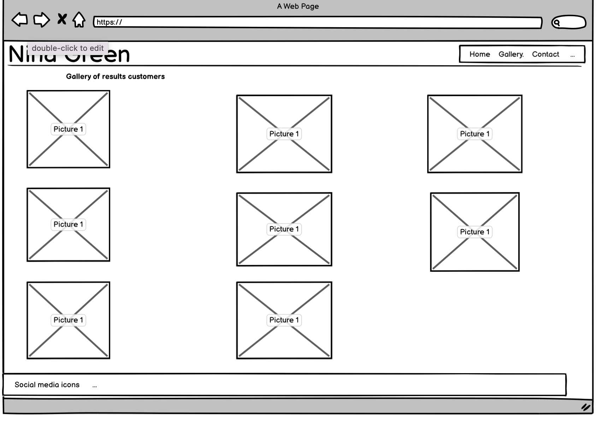

## Desktop View Form
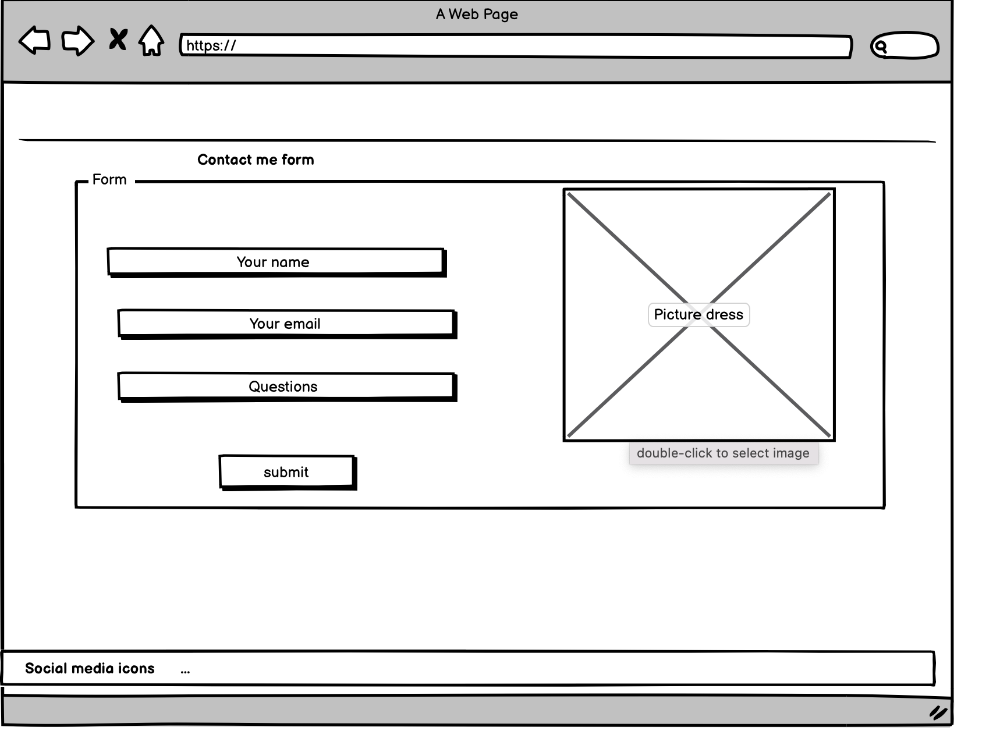

## Tablet View Home

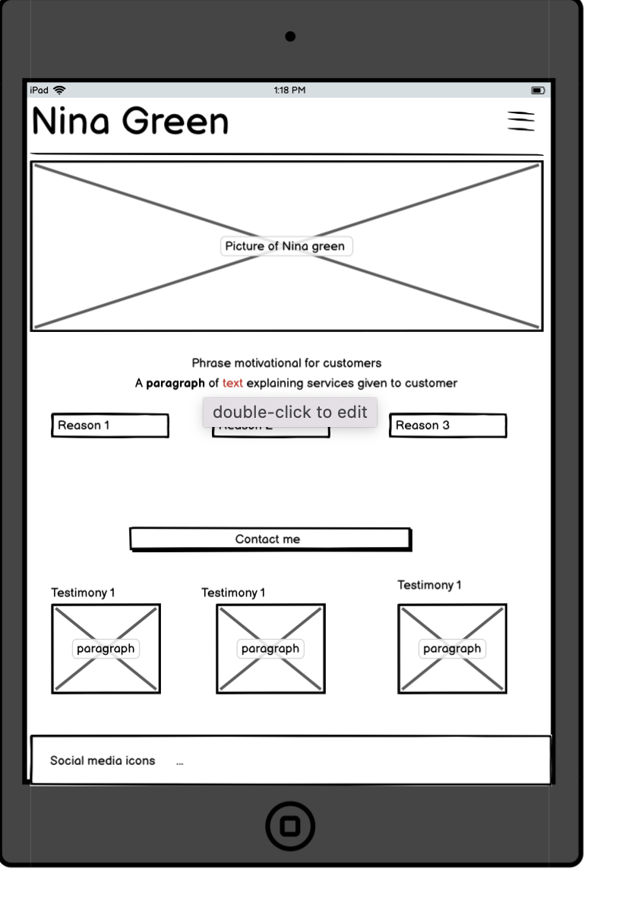 

## Tablet View Gallery

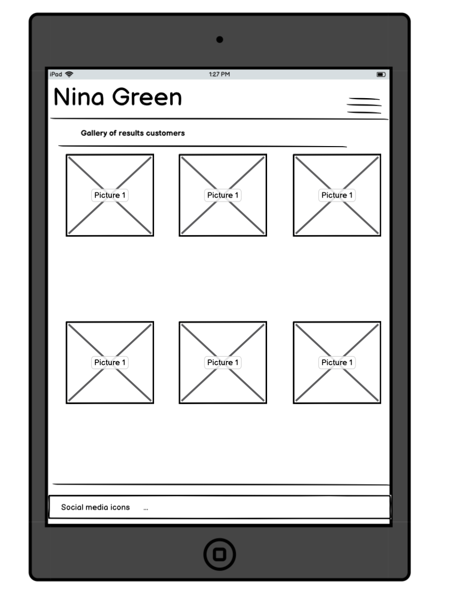 

## Tablet View Form

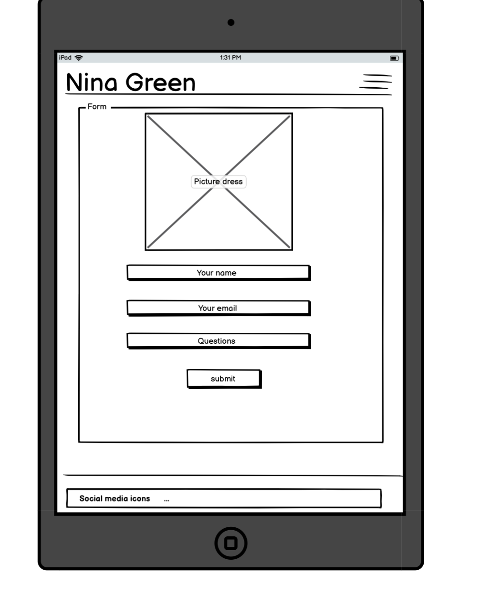 

## Mobile View Home

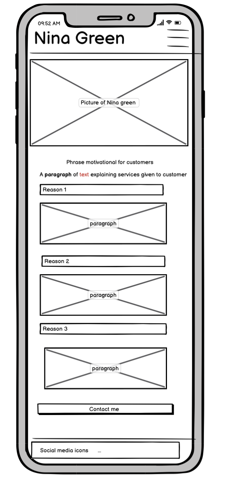 

## Mobile View Gallery

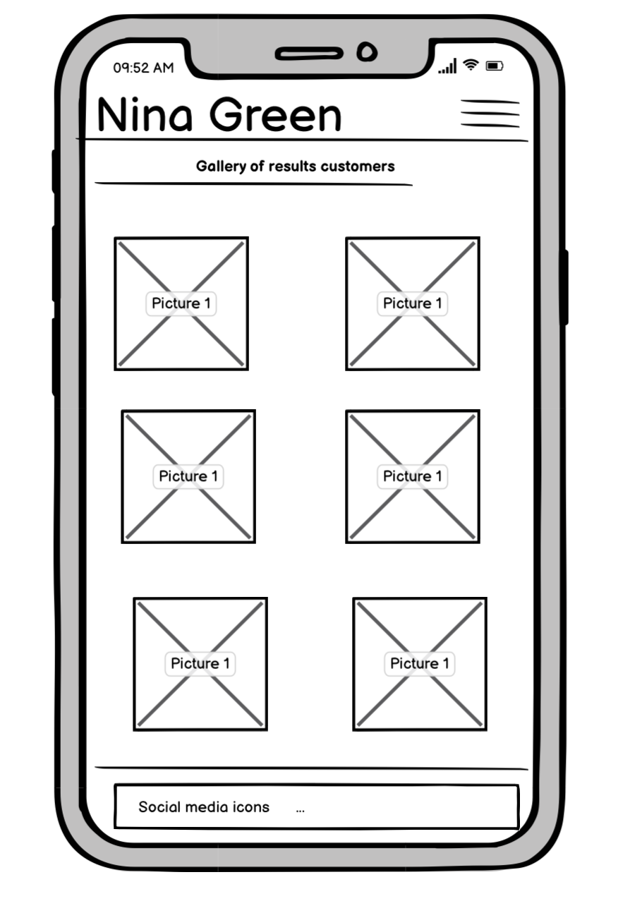 

## Mobile View Form

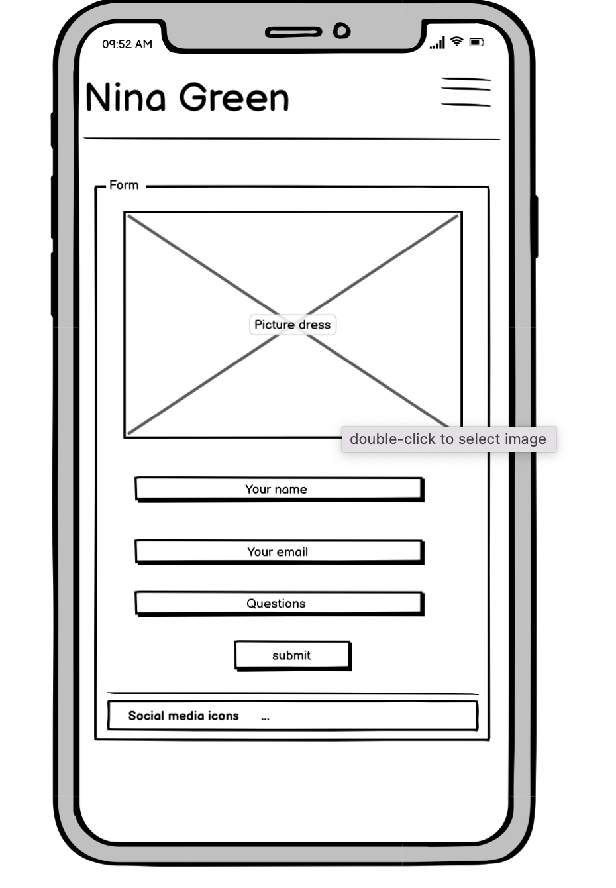 

## Surface

### Colors
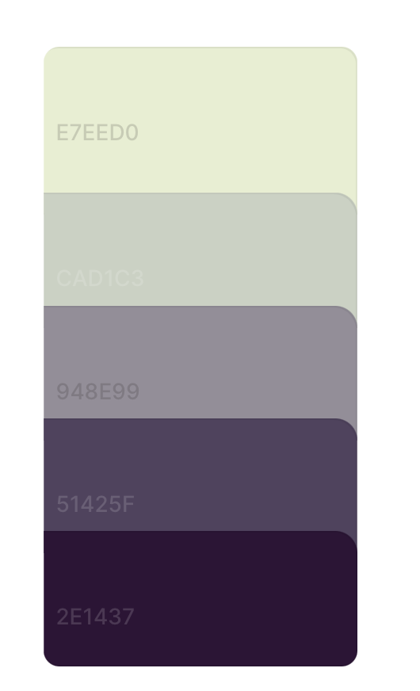 

Main colours used in a project:
* background color: #ffffff
* navigation bar color: #2e1437
* footer color1: #51425f

### Fonts 

* As a main font I used sans serif , and as a backup I used roboto and more. 

### Images

* I used images from [pexels.com](www.pexels.com) and there are credited in [credits](#credits) section.
* I used images from [thispersondoesnotexist.com](www.this-person-does-not-exist.com) and there are credited in [credits](#credits) section.
* I used images from [freepik.com](www.freepik.com) and there are credited in [credits](#credits) section.
* I used images from [unsplash.com](www.unsplash.com) and there are credited in [credits](#credits) section.

* I used images from [burst.shopify.com](www.burst.shopify.com) and there are credited in [credits](#credits) section.

[Back to Table of contents](#table-of-contents)
___
# Features

The website consists of three pages. Every page and section is accessible from the navigation menu.

The website has the folowing features:

## Navigation bar

* #### Navigation bar is visible on the top of each website. It is responsive and will adapt to mobile devices by a change into a burger menu.
* Navigation scheme:

    * On left side there I put a logo (personal stylist name). It can be used as navigation link to the main page.
    * On right side there are three links or a burger menu. It contains the following:
        * Home
        * Gallery
        * Contact

## Footer

* Footer is always consistent on all pages, it has social links centered on it.
Each link will open in a separate new tab in a browser. I've  added hover effects to each of them and it is based on the color pallete that has been choosen for the website.

## Home

* ### Services ,About section

    * This section includes personal stylist qualities and skills that she offers to her customer . 

* ### Testimonials section

    * This section includes 3 separate testimonials from current clients of the personal stylist.

## Gallery

* This page has pictures of 6 different customers and it is showing the results after using the personal stylist training and services.

## Contact

* The Contact form is the main part on this website. User can contact the personal stylist by filling a form with name , email and write any enquerie to her.
There's also a botton on the home page that links to the contact page.

##  Future implementations

* Add new page displaying  social media examples .
* A blog site with styles tips , seasonal trends, posting popular questions from customer and showing the answer on the website as a highlight in it .
* A Login site for different types of paid content including stylist masterclass, selling customize color palettes to customer .

[Back to Table of contents](#table-of-contents)
___
# Technologies used

### HTML5
* As a structure language.

### CSS
* As a style language.

### Bootstrap 
* Bootstrap as a CSS framework to keep responsive, mobile first aproach.

### Font Awesome
* As an icon library for a social links and the gallery header style.

### GitHub
* As a software hosting platform to keep project in a remote location.

### Git
* As a version-control system tracking.

### Gitpod
* As a development hosting platform.

### Balsamiq.cloud
* As a wireframing tool.

[Back to Table of contents](#table-of-contents)

___
# Testing

## Functionality testing 

 I used Chrome developer tools throughout the project for testing and solving problems with responsiveness and for style issues.

## Compatibility testing
 Site was tested across multiple virtual mobile devices and browsers. I checked all supported devices in Chrome developer tools. 
 
 I tested on hardware devices such as: Ipad air with iOS, Iphone SE mini with iOS , Macbook air with MacOS

## User stories testing

### As a business owner:

- I would like to present myself and my offer on the website clearly to potential customers.
    >The name of the personal stylist is her logo and at the same time , it has been display in the navigation bar at all times .Her photo is the first image presented to the customers  in the home page , and her proven skills is also highlited in the home page. 

- I need to make sure that my current and new customers will be able to always contact me with any questions and that it is easy to find the form to do it . 
    > Customers can achieve this by typing the info in  contact form. Customers  can choose any  topic of interest and problems that they may encounter  in a message box.

- I want my customers to be able to learn how to use my website intuitively and easily.
    > Each page has a fixed navigation menu and is accessible at all times. All content was design and presented with a minimalistic approach.

- I would like to keep building and maintain my relationship with potential and current customers.
    > Customers are able to find all links to social channels at the bottom of each page. Apart from the botton icons they can contact me with the contact form.

### As a new customer:
- I wish to find information about the personal stylist and check her previous achievement with the customers reviews and pictures proving this.
    > User can see all this essential description on the home page.

- I would like to get in touch with the personal stylist to ask about my seasonal palette and the typer of clothes that looks the best in me .
    > User can find a contact form in contact page to get in touch . 

### As a returning customer:
- I need to contact my personal stylist to do followups of new questions that I may have , also how to keep styling myself including the new trends.
    > User can find social media links at the botton of website to keep in touch with the stylist in that way they can check the lastest advice of new services.

- I want to show my family and friends pictures of her styling results .
    > The gallery page has different pictures of different types of customers and their results. 

---
## Issues found during site development

* #### Navbar links  displaying on the wrong side of the screen in desktops devices. 

When displaying the website on desktops devices , my navbar bar elements displayed on the left side of the screen right next to the logo and it making it look too crowded ruining the users experience.

> I fixed it by changing the bootstrap class name to ms-auto .

* #### The call to action botton was not centered in tablets , mobiles devices

When displayed on tablets and mobile devices the botton on the home page was looking out of placed , it was displayed on the left side. 

> I fixed this by taking it out of the buttob out of the previous div and giving it a new div with the bootstrap classes col and text-center. 

## Performance testing

I run [Lighthouse](https://chrome.google.com/webstore/detail/lighthouse/blipmdconlkpinefehnmjammfjpmpbjk?hl=es) tool to check performance of the website.
I had to do several changes to improve performance, specially replacing images for lighter formats such as .webp which improved the performance significantly. Screenshots are presented below:

Before:

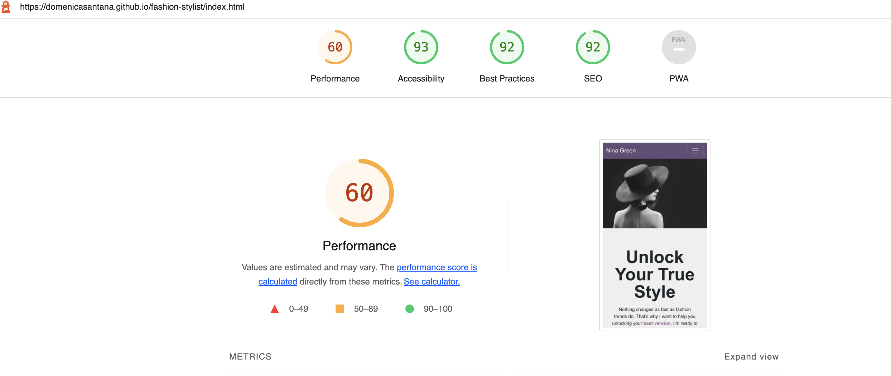

Final results:
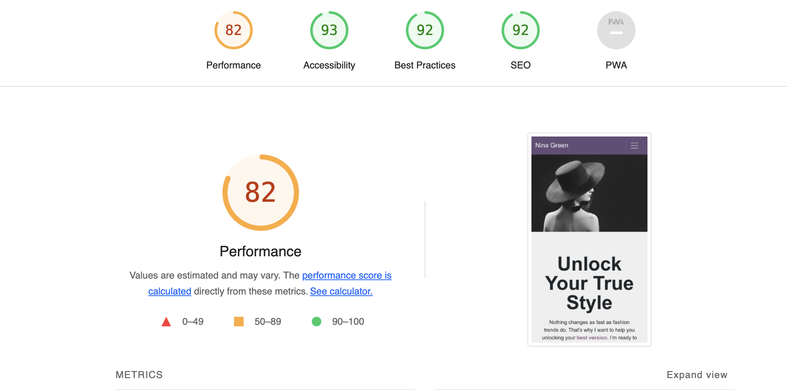

I noticed that this tests scores vary from time to time and depends on external libraries as well. 

## Code Validation
 At the and of the project I used two websites to validate my code
 
 * [W3C CSS Validator](https://jigsaw.w3.org/css-validator/) to validate CSS

 * [Nu Html Checker](https://validator.w3.org/) to test HTML

[Back to Table of contents](#table-of-contents)

___
# Deployment

The project was deployed on GitHub Pages. I used Gitpod as a development environment where I commited all changes to git version control system.
I used push command in Gitpod to save changes into GitHub.

To deploy a project I had to:

* Log in to GitHub and click on repository to deploy ([fashion-stylist](https://domenicasantana.github.io/fashion-stylist/index.html))
* select `Settings` and find GitHub Pages section at the very bottom of the page
* from source select `root` and then `main` branch.
* click `save` and page was deployed after auto-refresh.
>  Your site is published at https://domenicasantana.github.io/fashion-stylist/index.html

To run localy:
* Log in to GitHub and click on repository to download ([fashion-stylist](https://domenicasantana.github.io/fashion-stylist/index.htmls))
* select `Code` and click Download the ZIP file.
* after download you can extract the file and use it in your local environment 

Alternatively you can [Clone](https://docs.github.com/en/free-pro-team@latest/github/creating-cloning-and-archiving-repositories/cloning-a-repository)
or [Fork](https://docs.github.com/en/free-pro-team@latest/github/getting-started-with-github/fork-a-repo)
this repository ([fashion-stylist](https://github.com/domenicasantana/fashion-stylist)) into your github account.

[Back to Table of contents](#table-of-contents)
___
# Credits

* To complete this project I used Code Institute student template: [gitpod full template](https://github.com/Code-Institute-Org/gitpod-full-template)

* I used Startbootstrap's Full Width Pics template: [ template](https://startbootstrap.com/template/full-width-pics)

* Ideas and knowledge library:

    * [w3schools.com](https://www.w3schools.com)

    * [css-tricks.com](https://css-tricks.com/)

    * I used Startbootstrap's Gallery with Images Thumbnails template: [template](https://startbootstrap.com/snippets/thumbnail-gallery) 

     * [mdbootstrap.com](https://mdbootstrap.com/docs/standard/navigation/footer/)
     I used this code for the footer and then I customized with my own changes also using bootstrap. 

    
    * [stackoverflow.com](https://stackoverflow.com/) I used stack overflow constantly whenever I was unsure about HTML or CSS syntax or wanted to find an easier more stream-lined way of doing things.
   

* Other Tools:
  
   * [convertio.co](https://convertio.co/download/8f5e5e55e6f0ba84bea69ead1b619d2dd0cbf7/) I used convertio to convert my images to lighter formats which improved the performance of the site significantly.

### Code

* Bootdey: [services list](https://www.bootdey.com/snippets/view/Services)
I used this list template and then modified it . 
* Mdbootstrap: [Form](https://mdbootstrap.com/docs/standard/extended/registration/)
I used and modified this form 

### General Content:

*  Testimonials:  [bbbotstrao.com](https://bbbootstrap.com/snippets/bootstrap-5-user-testimonial-star-ratings-51527336)
I used this part of this code to the the testimony in homepage and then I modified it .

### Images:

#### freepik.com:
* [assets/images/black-background.jpg](https://www.freepik.com/free-photo/attractive-woman-wearing-hat-posing-black-background_14482579.htm#query=background%20fashion&position=21&from_view=search) image by serhii_bobyk on Freepik

* [assets/images/skirt-sweater.jpg](https://www.freepik.com/free-photo/set-with-fashionable-women-s-clothing-skirt-sweater-sandals-accessories-top-view-flat-lay_20083375.htm#page=2&query=clothes&position=12&from_view=search) image by pvproductions on freepik

#### pexels.com:
* [assets/images/pexels-aizhana-aldanova.jpg](https://www.pexels.com/photo/woman-wearing-white-shirt-and-yellow-skirt-sitting-on-brown-concrete-brick-stairs-983564/) Photo by Aizhana Aldanova from Pexels 

* [assets/images/pexels-anastasiya-gepp-2065200.jpg](https://www.pexels.com/photo/woman-standing-wearing-white-floral-lace-blouse-2065200/) Photo by Anastasiya Gepp from Pexels 

* [assets/images/pexels-godisable-jacob-1394882.jpg](https://www.pexels.com/photo/woman-standing-at-outdoors-while-holding-black-leather-bag-1394882/) Photo by Godisable Jacobs from Pexels 

* [assets/images/pexels-konstantin-mishchenko-1926769.jpg](https://www.pexels.com/photo/woman-standing-indoor-1926769/) Photo by Konstantin Mischchenko from Pexels 

#### thispersondoesnotexist.com:
* [assets/images/profile-picture-nina.webp](/this-person-does-not-exist.com) Photo by 

* [assets/images/avatar-millie.webp](/this-person-does-not-exist.com) Photo by 

* [assets/images/avatar-andrea.webp](/this-person-does-not-exist.com) Photo by 

#### unsplash.com:

* [assets/images/vladimir-yelizarov-2OhHpRu2Fhg-unsplash.jpg](https://unsplash.com/photos/2OhHpRu2Fhg) Photo by Vladimir Yelizarov

#### burst.shopify.com:
* [assets/images/womens-summer-fashion.jpg](https://burst.shopify.com/photos/womens-summer-fashion?q=fashion) Photo by 

[Back to Table of contents](#table-of-contents)
___

# Screenshots

## Project screenshots

### Home Page

### Contact Page

### Gallery Page

[Back to Table of contents](#table-of-contents)
___